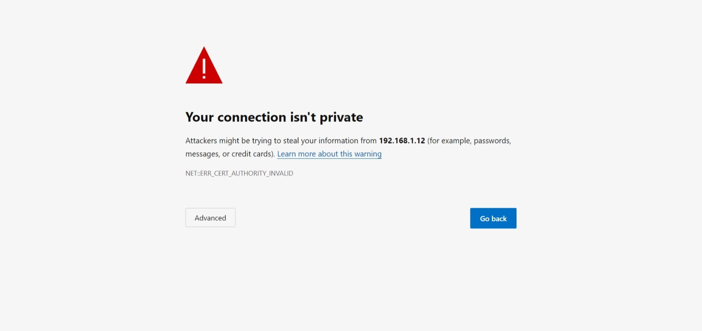
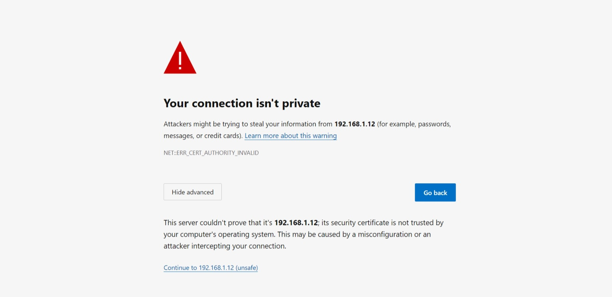

# OPNsense Firewall Setup

This project was about setting up an OPNsense firewall to secure a network. The steps included installing the firewall in VirtualBox, setting up WAN and LAN interfaces, and assigning IP addresses. A firewall rule was created to control traffic, and it was tested using Nmap to make sure everything worked as expected.


## Downloading OPNsense

1. Go to the official OPNsense download link: https://opnsense.org/download/
2. Select the following options:
	* Architecture: amd64
	* Image type: dvd (for VirtualBox)
	* Location: Choose the closest location (e.g., LeaseWeb)

   

3. Click Download and wait for the file to download.

### Extracting the Downloaded File

1. Go to your downloads folder and right-click on the downloaded file (a .rar file).
2. Click Extract Here to extract the contents.

   

## Creating a Virtual Machine in VirtualBox

1. Open VirtualBox and click on Tools from the sidebar.
2. Select New from the toolbar.

   

3. Enter the following details:
	* Name: OPNsense Firewall
	* Folder: Specify where you want the VM files to be saved.
4. Select the ISO Image dropdown and click Other to locate and select the .iso file downloaded earlier.
5. Choose the following settings:
	* Type: BSD
	* Version: FreeBSD (64-bit)

   
 
### Configuring Resources

1. Allocate at least 2 GB of RAM.
2. Allocate 1 core or more depending on your PC.
3. Leave other settings as default.

   


### Configuring Storage

1. Create a virtual hard disk:
	* Select Create a virtual hard disk now.
	* Use the VDI (VirtualBox Disk Image) format.
	* Choose Dynamically allocated storage.
	* Set the size to at least 16 GB.
2. Click Finish.

   


### Network Configuration

1. OPNsense requires at least two network adapters for WAN and LAN. Configure as follows:
	* Adapter 1:
		+ Go to Network > Adapter 1.
		+ Tick Enable Network Adapter.
		+ Set Attached to: Bridged Network
		
	
 	  

 	* Adapter 2:
		+ Go to Network > Adapter 2.
		+ Tick Enable Network Adapter.
		+ Set Attached to: Internal 
		+ For Name, enter intnet.
		

	  

2. Click OK to save the changes.

3. Kali Linux Network Configuration
   To connect your Kali Linux machine to the LAN network, follow these steps:
   - Adapter 1:
	   + Go to Network > Adapter 1.
	   + Enable the network adapter by ticking the Enable Network Adapter checkbox.
           + Set the adapter to connect to the internal network by selecting Internal from the Attached to dropdown menu.
           + Name the adapter intnet.
             
     

## Booting and Installing OPNsense

1. Boot the OPNsense Firewall machine.
2. Let it load automatically until it asks for login and password.
3. Login with the following credentials to install OPNsense:
	* Login: installer
	* Password: opnsense

   

4. Follow the installation prompts:
	* Select your keyboard layout (e.g., German).

   	  
	
 	* Continue.

	  
	
 	* Select Install ZTF.

	  
	
 	* Select Stripe.

	  
	
 	* Press Space and then OK (Enter).

	  
	
 	* Press Yes.

	  

5. Change your password and exit.
6. Reboot the machine.

   
   

### Assign WAN and LAN interfaces

1. Login with the OPNsense default username and password:
	* Username: root
	* Password: opnsense

   	  

2. Enter option 1 to assign the interfaces: 1 Assign interfaces
3. Answer "No" to the following prompts:
	* Do you want to configure LAGGs now? N
	* Do you want to configure VLANs now? N
4. After answering "No" to the above prompts, OPNsense will display a list of valid interfaces. To identify which interface corresponds to which network adapter, we need to match the MAC addresses.
5. To do this, follow these steps:
	* Go to the VirtualBox settings for the OPNsense virtual machine.
	* Click on "Network" and then select "Adapter 1".
	* Click on "Advanced" and look for the MAC address without colon separation (e.g., 080027111111).
	* Note down the MAC address.
6. Now, look at the list of valid interfaces displayed in the OPNsense command line. Find the interface that matches the MAC address you noted down in step 5. This interface corresponds to Adapter 1.
7. Repeat steps 5-6 for Adapter 2 to find the corresponding interface.
8. Enter the interface names for WAN and LAN:
	* Enter the WAN interface name: em0 (this corresponds to Adapter 1)
	* Enter the LAN interface name: em1 (this corresponds to Adapter 2)

   
   
10. Enter the optional interface name - press [Enter] for none
11. Confirm the interface assignments:
	* Interfaces will be assigned as follows:
		+ WAN -> em0
		+ LAN -> em1
12. Answer "Yes" to proceed.
    
    


### Configure WAN and LAN Interface IP Address

**WAN**
1. Enter option 2 to Set interface IP address.
2. Configure the WAN interface IP address:
	* Answer "No" to Configure IPv4 address WAN interface via DHCP?
	* Enter the new WAN IPv4 address: 192.168.1.4
	* Enter the new WAN IPv4 subnet bit count (subnet mask): 24
	* Leave the upstream gateway address blank (press [Enter] for none)
   
3. Configure the WAN interface IPv6 address:
	* Answer "No" to Configure IPv6 address WAN interface via DHCP6?
	* Press [Enter] to leave the WAN IPv6 address blank

   
4. Answer "No" to change the web GUI protocol from HTTPS to HTTP.
5. Answer "Yes" to generate a new self-signed web GUI certificate.
6. Answer the prompt to restore web GUI access defaults.

**LAN**
1. Enter option 1 to set the LAN interface IP address.
2. Configure the LAN interface IP address:
	* Answer "No" to Configure IPv4 address LAN interface via DHCP?
	* Enter the new LAN IPv4 address: 192.168.1.1
	* Enter the new LAN IPv4 subnet bit count (subnet mask): 24
	* Leave the upstream gateway address blank (press [Enter] for none)
   
3. Configure the LAN interface IPv6 address:
	* Answer "No" to Configure IPv6 address LAN interface via DHCP6?
	* Press [Enter] to leave the LAN IPv6 address blank
   
4. Answer "No" to enable the DHCP server on LAN.
5. Answer "No" to change the web GUI protocol from HTTPS to HTTP.
6. Answer "Yes" to generate a new self-signed web GUI certificate.
7. Answer the prompt to restore web GUI access defaults.
   


## OPNsense Initial Setup Wizard

After configuring the WAN and LAN interfaces, you can now access the web GUI by opening the following URL in your web browser within Kali Linux virtual machine:

https://192.168.1.1




### Login to OPNsense

* Login with the OPNsense default username and password:
	+ Username: root
	+ Password: opnsense

  

  
### General Setup

1. Click Next to start the setup wizard.
   
   
   
### General Information

1. Change the hostname (optional).
2. Leave the other settings at the defaults.
   
   

   
### Time Server Information

1. Set the timezone.

   


### Configure WAN Interface

You can configure the WAN interface using either DHCP or a static IP address. For this setup, we will use DHCP, but if you have obtained the necessary IP addressing details from your Internet provider, you can also use a static IP address.

#### Configure WAN Interface using DHCP

1. Select DHCP as the configuration method.
2. This is usually the default setting for most home broadband connections with a dynamic WAN IP address.

   
   
#### Configure WAN Interface using Static IP Address (Optional)

1. Select Static as the IPv4 configuration method.
2. Enter your WAN IP address in CIDR format and upstream gateway IP address.
3. You should obtain these IP addressing details from your Internet provider.
4. Leave the other settings as the defaults.
   
   
   
### Configure LAN Interface

1. Set the LAN IP address to 192.168.1.12.
2. Set the Subnet Mask to 24.
   
   
   
### Set Root Password

1. Change the root password.
   
   
   
### Reload Configuration

1. Click reload to apply the changes.

   

## Verifying OPNsense Configuration with Nmap: Blocking SMB Port 445

### Create a Rule to Block SMB Port 445
1. After setting up the general settings, navigate to the Firewall > Rules page
2. Click the "Add" button to create a new rule
3. Set the action to "Block"
4. Set the protocol to TCP
5. Set the source to "any"
6. Set the destination to "any"
7. Set the destination port to (other) from:445 to: 445
8. Leave all other settings at their default values
9. Click "Save" to save the rule


### Run an Nmap Scan to Verify the Rule
1. Open the Nmap GUI application on your Windows machine
2. Type the following command in the "Command" field:
```bash
nmap -p 445 192.168.1.1
```
3. The "Target" field will automatically fill with the IP address (192.168.1.12)
4. Click the "Scan" button to start the scan
5. Look for the output to verify that port 445 is closed or blocked.

**Expected Output:**

Port 445 should be listed as "closed" or "filtered" in the Nmap output, indicating that the rule is working as expected.

**Actual Output:**


**Conclusion:**

The OPNsense configuration has been successfully verified using Nmap, and the rule to block SMB port 445 is working as expected.
